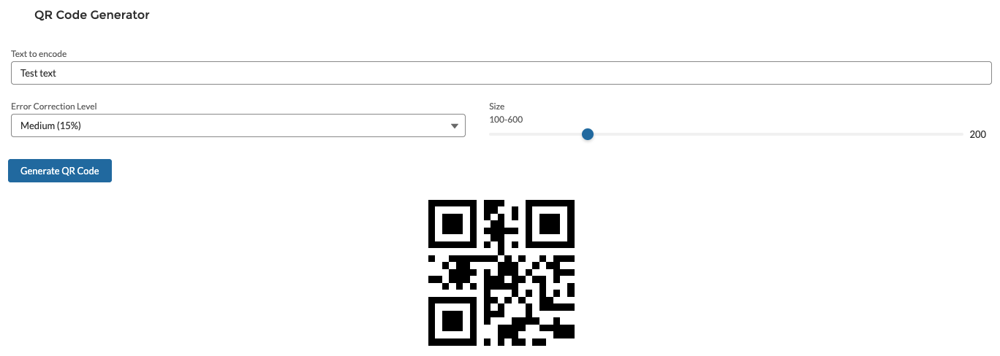

# QR Code Generator LWC for Salesforce

A Lightning Web Component (LWC) that generates QR codes directly in Salesforce. This component allows users to create QR codes from text, URLs, or any other information, adjust the error correction level, and customize the size.



## Features

- Generate QR codes from any text or URL
- Adjust QR code size with a slider
- Select error correction level (Low 7%, Medium 15%, Quartile 25%, High 30%)
- Clean, responsive UI using Salesforce Lightning Design System
- Option to hide UI controls for embedded use
- API properties for integration with other components

## Installation

### Option 1: Deploy to Your Org (Recommended for Quick Testing)

[](https://githubsfdeploy.herokuapp.com)

### Option 2: Manual Installation

1. Clone this repository:
   ```bash
   git clone https://github.com/nikolafilip/QR-Code-Generator.git
   cd QR-Code-Generator
   ```

2. Deploy the component to your org using the provided manifest:
   ```bash
   sfdx force:source:deploy -x manifest/package.xml
   ```

   That's it! All components including the QRCode.js library (as a static resource) are included in the package.

## Usage

### As a Standalone Component

1. Add the QR code generator component to any Lightning page:
   - Open the page in Lightning App Builder
   - Drag the "QR Code Generator" component from the custom components section
   - Save the page

2. To generate a QR code:
   - Enter text or URL in the input field
   - Adjust size and error correction level if needed
   - Click "Generate QR Code"

### As an Embedded Component

You can use the QR Code Generator as a child component with the UI controls hidden:

```html
<c-qr-code-generator
    hide-controls="true"
    text={myQrCodeText}
    qr-size="300"
    error-correction-level="M">
</c-qr-code-generator>
```

## API Properties

| Property | Type | Description | Default |
|----------|------|-------------|---------|
| `hideControls` | Boolean | When true, only displays the QR code without UI controls | false |
| `text` | String | The text or URL to encode in the QR code | '' |
| `qrSize` | Integer | Size of the QR code in pixels (100-600) | 400 |
| `errorCorrectionLevel` | String | Error correction level (L, M, Q, H) | 'H' |

## Component Structure

- **force-app/main/default/lwc/qrCodeGenerator** - The main LWC component
- **force-app/main/default/staticresources/qrcodejs** - QRCode.js library (already included)

## Contributing

Contributions are welcome! Please feel free to submit a Pull Request.

1. Fork the repository
2. Create your feature branch (`git checkout -b feature/amazing-feature`)
3. Commit your changes (`git commit -m 'Add some amazing feature'`)
4. Push to the branch (`git push origin feature/amazing-feature`)
5. Open a Pull Request

## License

This project is licensed under the MIT License - see the [LICENSE](LICENSE) file for details.

## Acknowledgments

- [QRCode.js](https://github.com/davidshimjs/qrcodejs) - JavaScript library for generating QR codes
- [Salesforce Lightning Design System](https://www.lightningdesignsystem.com/) - UI framework
